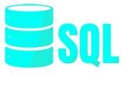

# DATA ANALYST

### Technical Skills:  SQL, Excel, Tableau.

## Education 
- Ph.D., Biomathematics | University of Nigeria, Nsukka 
- MS.c, Mathematics | Universty of Ibadan, Oyo State( April 2018)
- BS.c, Mathematics | University of Nigeria, Nsukka (June 2013)

## Work Experience
**Data Analyst @ Currency Photo Colour Lab (Dec 2020-Nov 2022)
- Collect and consolidate data from various sources within the lab, including digital imaging equipment, software systems, and databases.
- Define and track key performance indicators (KPIs) related to photo production efficiency, quality, and turnaround times.
- Develop dashboards and reports to visualize performance metrics for easy interpretation by stakeholders.

## Projects
### Properties Vendor
- TOOLS:
  
       |and |   
 [View Project](https://public.tableau.com/app/profile/arinze.luke.ozioko/viz/PropertiesSoldAtTNState/Dashboard1) | [Download](https://github.com/Arinzeluke/SQL-FOR-DATA-CLEANING)
- Purpose: The purpose of analyzing this dataset is to gain insights into the real estate market, understand property characteristics, and identify patterns or trends that can inform decision-making. The dataset allows for exploration of property values, sales trends, and other relevant factors that may impact the real estate market.
- Skills Used in the Project:
 | Data cleaning skill with SQL
 | Data analysis skill with Tableau
 | Data visualization (dashboard) skill with Tableau
- Observation and Recommendations: Observations and Recommendations: I have observed that Nashville is a thriving city in the real estate market. Single-family houses are currently trending, followed by duplexes. This conclusion is drawn from the fact that the majority of acreage is utilized for single-family houses more than any other type. It is surprising that houses built in the year 1930 command higher sales prices. Additionally, I noticed that the peak sales month is June, closely followed by May. In terms of sales years, 2016 takes the lead, followed by 2015. Based on this analysis, I recommend that real estate investors, developers, or policymakers take a closer look at these observations for strategic insights and decision-making.

### Bike Purchase Analysis
- TOOLS:
  
          
- Objective: The objective is to ensure the data is accurate, complete, and free from errors and communicate insights and patterns visually
- Activities: Check for missing values in each column and decide on an appropriate strategy.
Identify and handle any duplicate entries.Verify the data types of each column and convert them if needed. Check for outliers in numerical columns and decide on appropriate actions (remove, transform, etc.). Address any inconsistencies or errors in categorical variables.Created age bracket (Age < 29= "Young people",30-49="Adult and 50 and above= Old people)and income bracket(10K-49k,50k-100k,101k-170k). Create visualizations tailored to answer specific business questions. Visualize the distribution of income, age, and other relevant variables.
- Tools: Excel
  
[View Project](https://public.tableau.com/app/profile/arinze.luke.ozioko/viz/BikePurchaseSummary/Dashboard1?publish=yes)

Navigate through the slicer,  [Download Here](https://github.com/Arinzeluke/Excel-for-Data-Analysis/blob/main/Excel%20Project%20Dataset.xlsx)

### Balaji Food Sales 

- Objective: The objective is to ensure the data is accurate, complete, and free from errors and communicate insights and patterns visually
- Activities: Check for missing values in each column and decide on an appropriate strategy.
Identify and handle any duplicate entries.Verify the data types of each column and convert them if needed. Check for outliers in numerical columns and decide on appropriate actions (remove, transform, etc.). Address any inconsistencies or errors in categorical variables. Create visualizations tailored to answer specific business questions. Visualize the distribution of income, food, and other relevant variables.
- Tools: Excel
  
[View Project](https://1drv.ms/x/c/39910e63a33a86fb/EfticvSak0JIiqC7ut2tzYoBdi0bTqEFom6AJgkWjwQK0g?e=FVPTrt)

Navigate through the slicer,  [Download Here](https://github.com/Arinzeluke/Balaji-Food-Sales/blob/main/Balaji%20Fast%20Food%20Sales.xlsx)
 
